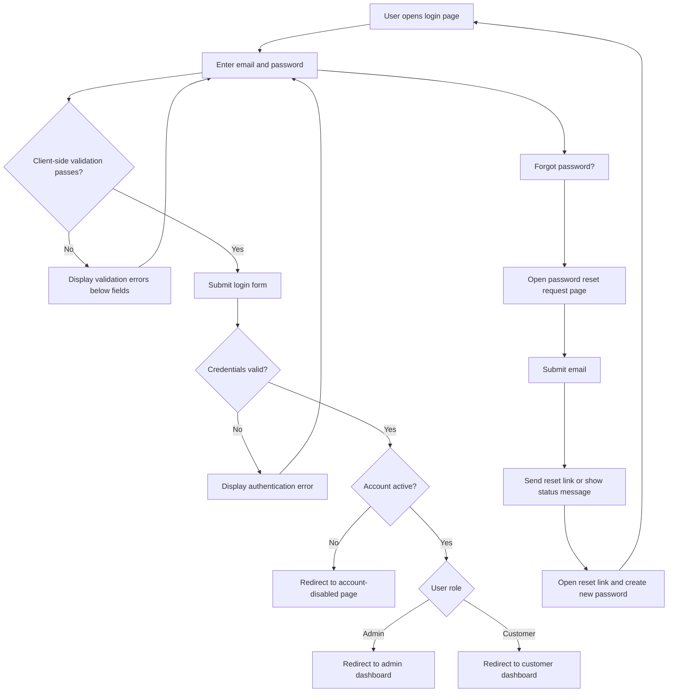
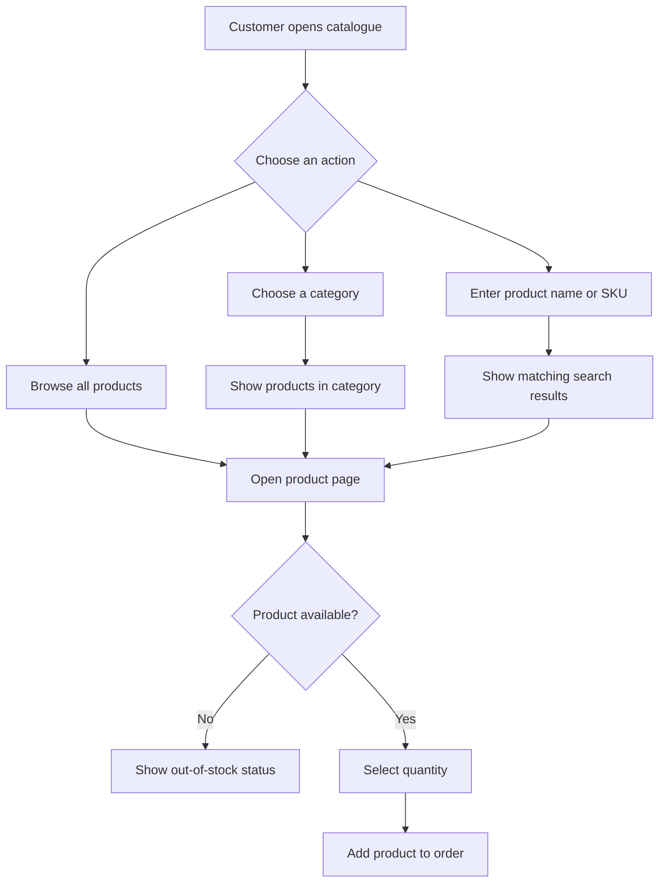
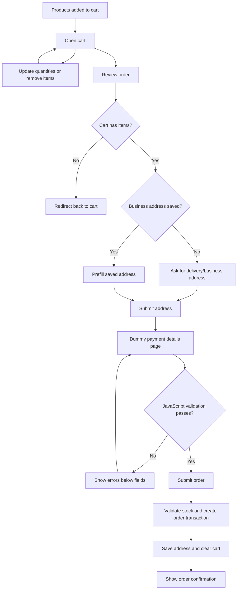
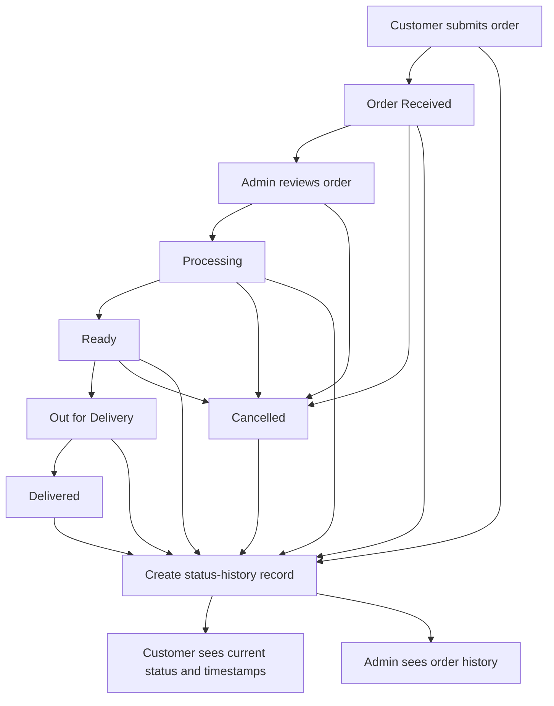
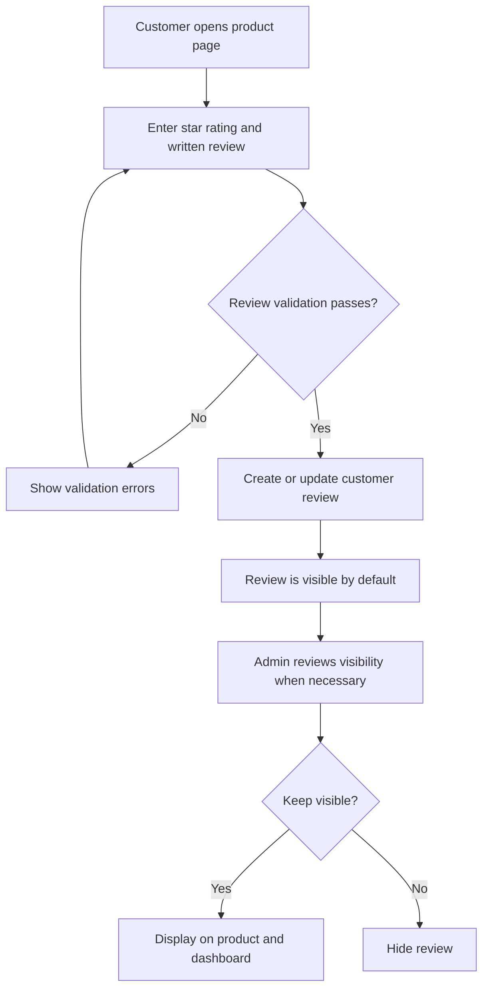
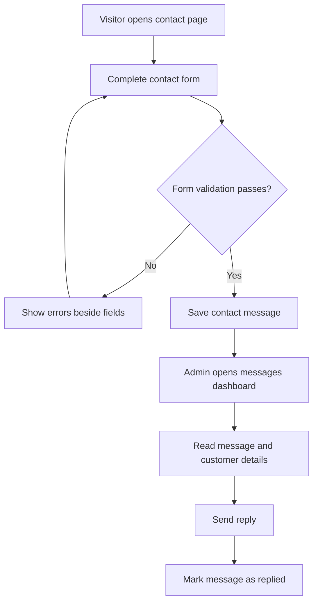
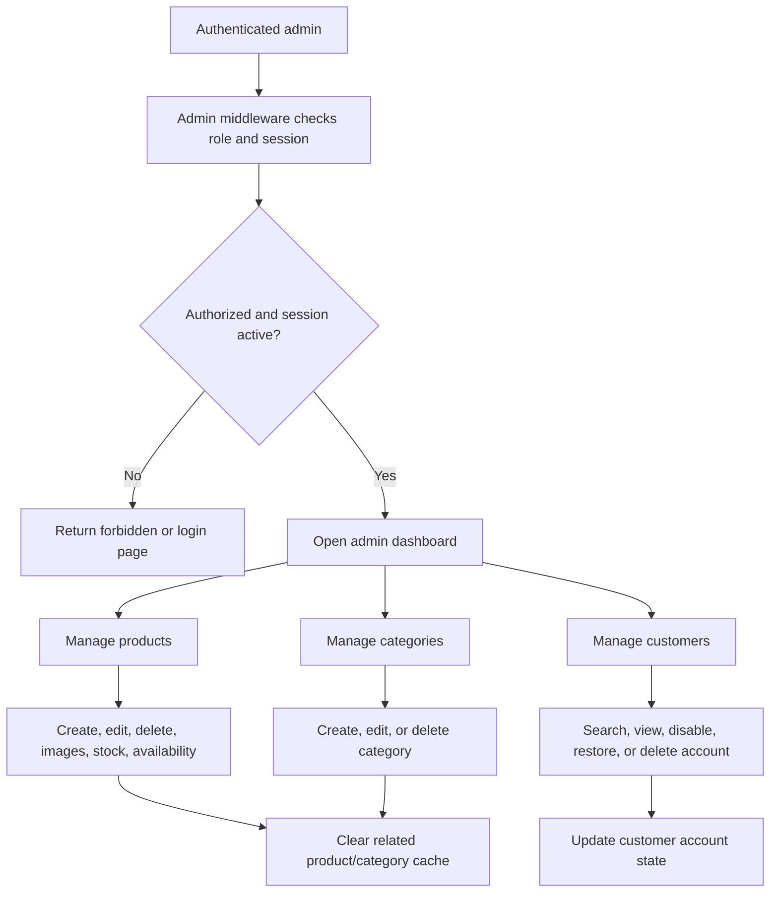

# CraveSupply Project Documentation

CraveSupply is a Laravel 12 B2B snack-ordering website. Customers browse snack products, add quantities to an order, submit delivery details, and track order progress. Administrators manage the catalogue, customers, reviews, contact messages, and orders.

## Technology

- PHP 8.2+
- Laravel 12
- Blade templates
- Eloquent ORM and migrations
- Mysql
- Vite/NPM assets
- DomPDF for downloadable order bills
- PHPUnit/Pest-compatible Laravel test runner

## Main user roles

### Customer

Customers can register, verify their email, log in, reset their password, update their profile, delete their account, browse products, manage a cart, place orders, review products, and view their own order history.

### Admin

Admins have a protected dashboard for managing products, categories, customers, orders, reviews, and contact messages. Admin sessions expire after one hour of inactivity.

## Customer functionality

### Homepage and catalogue

- `/` redirects authenticated administrators to the admin dashboard and other users to the customer dashboard.
- `/dashboard` displays featured/random available products and approved reviews.
- `/products` displays the product catalogue.
- `/products/category/{category}` filters products by category.
- `/products/{product}` displays a product profile.
- `/search/suggestions` provides product search suggestions.
- Products support names, SKU, descriptions, prices, availability, stock, categories, multiple images, and reviews.

### Cart and checkout

The order flow is:

```text
Browse → Product page → Add to order → Cart → Review order → Dummy payment details → Confirmation
```

- Cart quantities can be updated or removed.
- The review page calculates subtotal, delivery charge, and total.
- Customers without a saved business address are prompted to provide one.
- The submitted delivery address is saved to `users.business_address` for future orders.
- The payment page is only a dummy UI step. Card details are validated in JavaScript and server-side, but are never processed or stored.
- Orders receive a unique order number and preserve product name, quantity, and price at order time.

### Orders and tracking

- `/orders` displays the authenticated customer’s orders.
- `/orders/{order}/confirmation` displays confirmation, items, delivery address, total, current status, progress bar, and status timestamps.
- `/orders/{order}/bill` downloads a PDF bill.
- Customers can only access their own orders unless they are administrators.

Supported statuses:

1. Order Received
2. Processing
3. Ready
4. Out for Delivery
5. Delivered
6. Cancelled

Each status transition is stored in `order_status_histories` with the user who changed it and its timestamp.

### Reviews

Customers can leave one review per product with a star rating and comment. Reviews are currently approved by default, and administrators can toggle review visibility.

### Contact

- `/contact` displays the contact page and form.
- Contact submissions store the customer name, business name, email, phone, and message.
- Administrators can view messages and send replies from the admin area.

## Admin functionality

Admin routes are protected by authentication, account-status checks, and the `Admin` middleware.

- `/admin` — dashboard metrics and recent activity
- `/admin/orders` — search, filter, inspect, and update order statuses
- `/admin/categories` — create, edit, and delete categories
- `/products/add` — create products
- `/products/{product}/edit` — edit/delete products and manage images
- `/admin/customers` — search and view customers
- `/admin/customers/deleted` — restore or permanently remove deleted customers
- `/admin/messages` — view contact messages and reply
- Review visibility can be toggled from the admin product/review interface.

When an order is cancelled, its item quantities are returned to product stock.

## Database entities

The migrations currently provide tables for:

- `users` — customer/admin accounts, business details, roles, active state, and soft deletes
- `categories` — product categories
- `products` — catalogue products, stock, price, description, and availability
- `product_images` — multiple images per product
- `orders` — order number, customer, delivery address, status, and total
- `order_items` — order-time product snapshots, quantities, and unit prices
- `order_status_histories` — append-only order status timeline
- `reviews` — product ratings/comments and approval state
- `contact_messages` — contact form submissions and reply state

The project uses `users.business_address` for the customer’s saved business address rather than a separate businesses table.

## Important routes

### Authentication

- `GET /register`
- `POST /register`
- `GET /login`
- `POST /login`
- `POST /logout`
- `GET /forgot-password`
- `GET /reset-password/{token}`
- `GET /profile`

### Cart and ordering

- `GET /cart`
- `GET /cart/review`
- `POST /cart/submit` — legacy/direct checkout endpoint
- `POST /orders/payment` — opens dummy payment details
- `POST /orders/payment/submit` — validates dummy payment fields and creates the order
- `GET /orders`
- `GET /orders/{order}/confirmation`
- `GET /orders/{order}/bill`

## Validation and security

- Passwords use Laravel’s hashed password cast.
- Forms use CSRF protection.
- Form requests and controller validation protect user input.
- Admin routes use the `Admin` middleware.
- Customer order ownership is checked before confirmation and bill access.
- Account status is checked by `EnsureAccountIsActive`.
- Product stock is locked during order creation to reduce overselling.
- Order creation and status changes use database transactions.
- Product/category caching is cleared after relevant changes.
- Production deployment should use HTTPS, `APP_DEBUG=false`, a secure `APP_KEY`, and protected environment variables.

## Local setup

Requirements: PHP 8.2+, Composer, Node.js/NPM, and a database supported by Laravel.

```bash
composer install
copy .env.example .env
php artisan key:generate
php artisan migrate
npm install
npm run build
php artisan serve
```

For active development, the project also provides:

```bash
composer run dev
```

Configure mail, database, cache, queue, and Redis values in `.env` as needed. The example environment uses SQLite, database sessions, database cache, database queues, and log mail delivery.

## Testing

Run:

```bash
php artisan test
```

The repository currently contains example feature/unit tests and an order-status unit test. The default feature example test may need updating because `/` intentionally redirects to a dashboard route.

## Current limitations and future improvements

- `/` currently redirects instead of serving a separate public marketing homepage.
- There is no separate `businesses` table or multi-contact business model.
- The payment screen is intentionally a dummy form with no payment gateway.
- HTTPS is a deployment/server responsibility and is not enforced by the application code.
- Test coverage should be expanded around checkout, authorization, stock, status transitions, and review moderation.
- A dedicated admin order-details route could be added if individual orders should have their own admin page.

## Login page flow chart



### Login flow summary

1. The user opens `/login` and enters their email and password.
2. Invalid input is rejected and the error is displayed beside the relevant field.
3. Valid credentials are authenticated by Laravel.
4. Inactive accounts are redirected to `/account-disabled`.
5. Administrators are redirected to `/admin`.
6. Customers are redirected to `/dashboard`.
7. Users can use the forgot-password link to request a password reset.

## Product browsing and search flow



## Cart and checkout flow



## Order status and tracking flow



## Product review flow



## Contact-message flow



## Admin catalogue and customer-management flow


